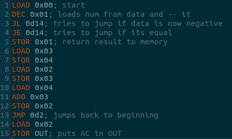

# EMU - Эмуляторное Машинное Управление

Система состоит из функции парсера и класса ЭВМ. Используются домены имен: программа без расширения, бинарная форма программы имеет расширение .prg, ячейки памяти имеют расширение .dat.

Пример записи "hello" "hello.prg" "hello.dat".

Регистры:
- OUT - вывод;
- IR - инструкция;
- MAR - адрес;
- MDR - ячейка памяти;
- AC - аккумулятор;
- PC - счетчик;
- F - системный флаговый регистр.

Система автоматически добавляет к счетчику 1 каждую команду. Помимо этого MDR почти всегда загружает в себя данные из оперативки и выгружает в нее данные, за исключением случаев работы с регистрами. MAR всегда равен аргументу команды, пока тот является числом.

Команды:
- LOAD - загрузка из MDR\[MRA\] в AC;
- STOR - AC выгружается в MDR\[MAR\];
- ADDI - AC загружает в себя результат AC+MDR\[MAR\]+1;
- ADD - AC загружает в себя результат AC+MDR\[MAR\];
- INC - AC загружает в себя результат MDR\[MAR\]+1;
- SUBD - AC загружает в себя результат AC-MDR\[MAR\]-1, может менять состояние F;
- SUB - AC загружает в себя результат AC-MDR\[MAR\], может менять состояние F;
- DEC - AC загружает в себя результат MDR\[MAR\]-1, может менять состояние F;
- MUL - AC загружает в себя результат AC*MDR\[MAR\];
- DIV - AC загружает в себя результат AC/MDR\[MAR\];
- AND - AC загружает в себя результат AC&MDR\[MAR\];
- OR - AC загружает в себя результат AC|MDR\[MAR\];
- NOT - AC загружает в себя результат ~MDR\[MAR\];
- JMP - PC получает значение MAR-1;
- CLS - AC загружает в себя 0;
- JNE - если в F нет бита указывающего на обнуление загружает в PC значение MAR-1;
- JE - если в F есть бит указывающий на обнуление загружает в PC значение MAR-1;
- JL - если в F есть бит указывающий на отрицательное число загружает в PC значение MAR-1;
- JG - если в F нет бита указывающего на отрицательное число загружает в PC значение MAR-1.

Возможно использование разных форм записи чисел, поддерживаемые формы:
- 0b - бинарные, не факт, что будут использоваться;
- 0x - шестнадцатиричные, рекомендуются для общения с ОЗУ;
- 0d - десятичные, рекомендуются для JMP, JNE, JE, JL, JG.

Пример простой программы считающей числа Фибоначчи

